# 简介

可用于Hex、S19、Bin文件间相互转换的小工具。

可以选择是否填充并自定义填充值；可以在转换时选择是否在每段末尾加上CRC校验值；可以自定义CRC算法并保存以便今后使用；可以限制输出范围。

# 使用方法

## 前言

界面的最底部是状态栏，将鼠标放于大部分组件上时状态栏都会显示对应的信息以提示其使用方法。

若需获取帮助，可单击菜单栏中帮助->文档或帮助->技术支持来发送邮件。

## 导入操作

直接将需要导入的文件拖放至界面中即可完成导入操作：

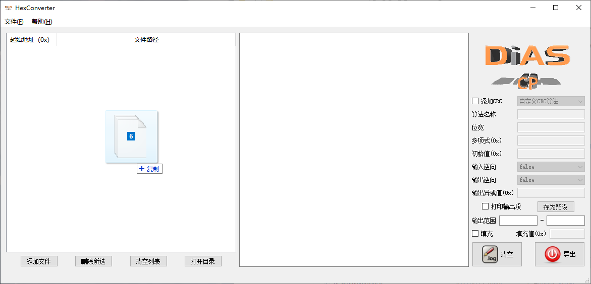

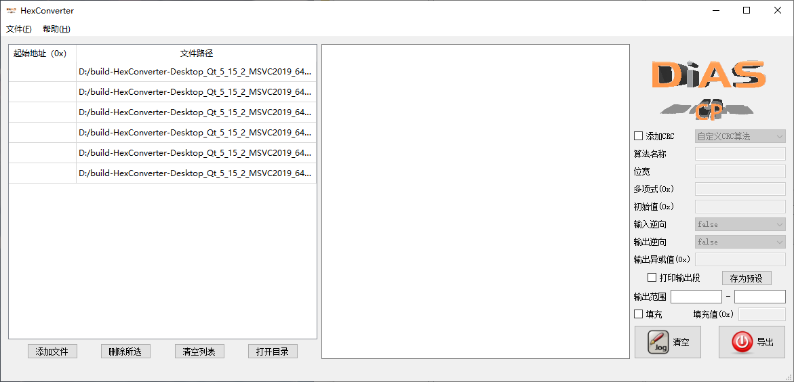

## 删除操作

选中需要删除的行然后单击“删除所选”按钮即可：

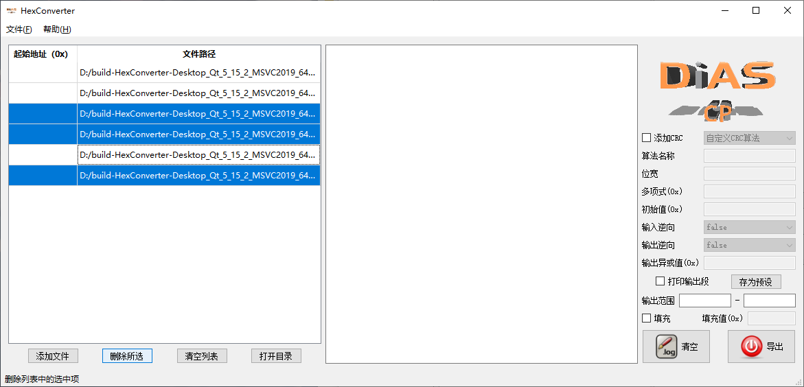

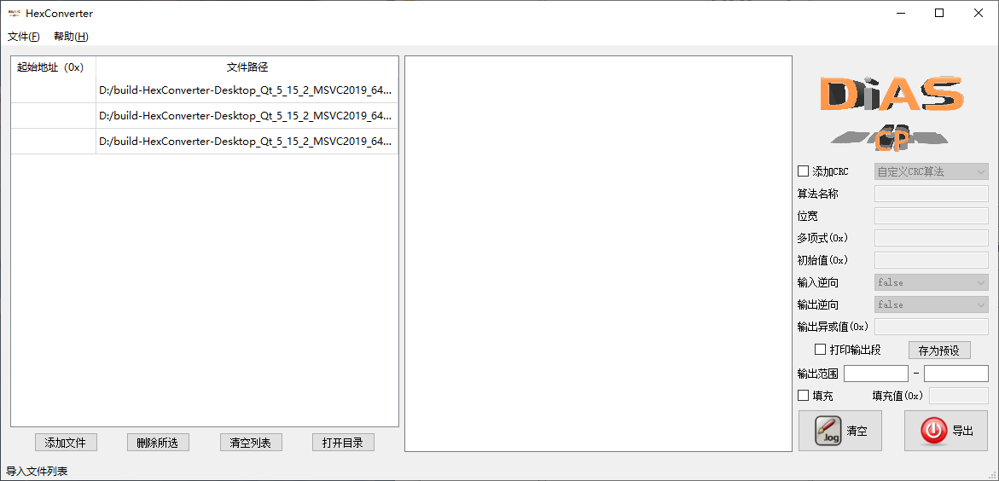

若想删除列表中的所有文件，则可以直接单击“清空列表”按钮。

## 查看文件

如需在系统资源管理器中查看文件，在列表中选中欲查看的文件后单击“打开目录”按钮，便会自动定位文件：

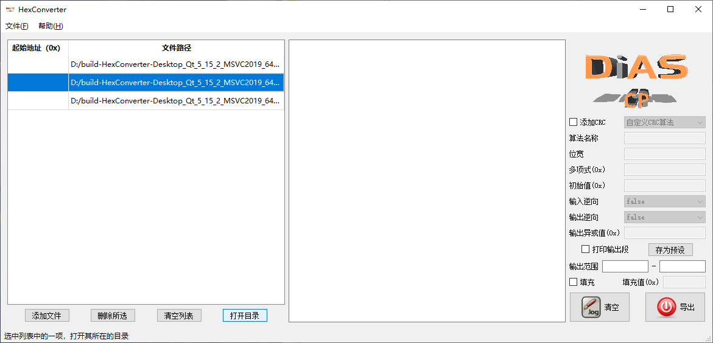

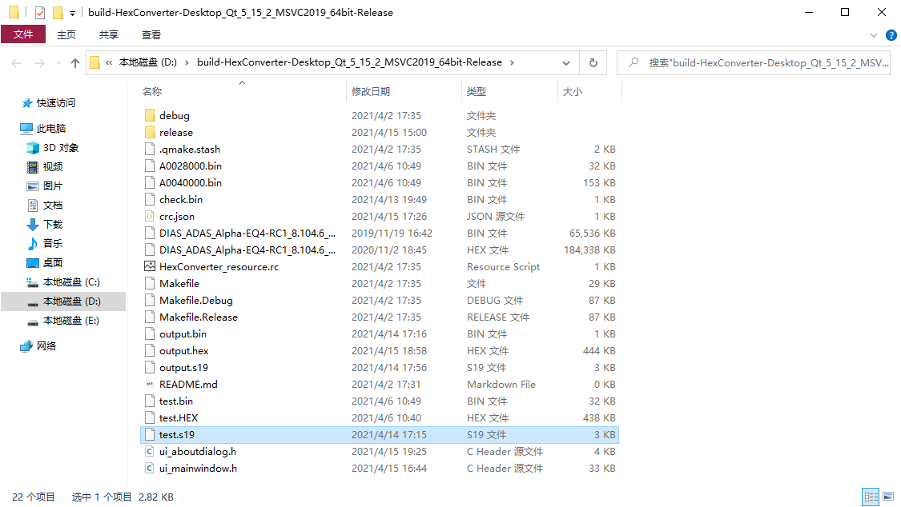

## CRC计算

默认是不进行CRC计算的，若想计算CRC校验值，需要勾选“添加CRC”选框，并从其后的下拉菜单中选择所需算法：

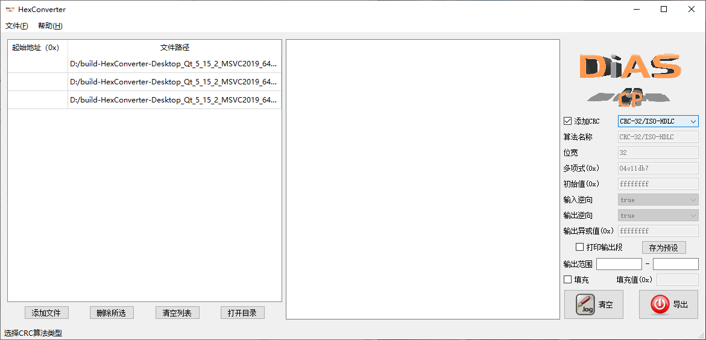

### 自定义CRC算法

若想自定义CRC算法，选中下拉菜单中的“自定义CRC算法”项，此时便可自定义算法细节：

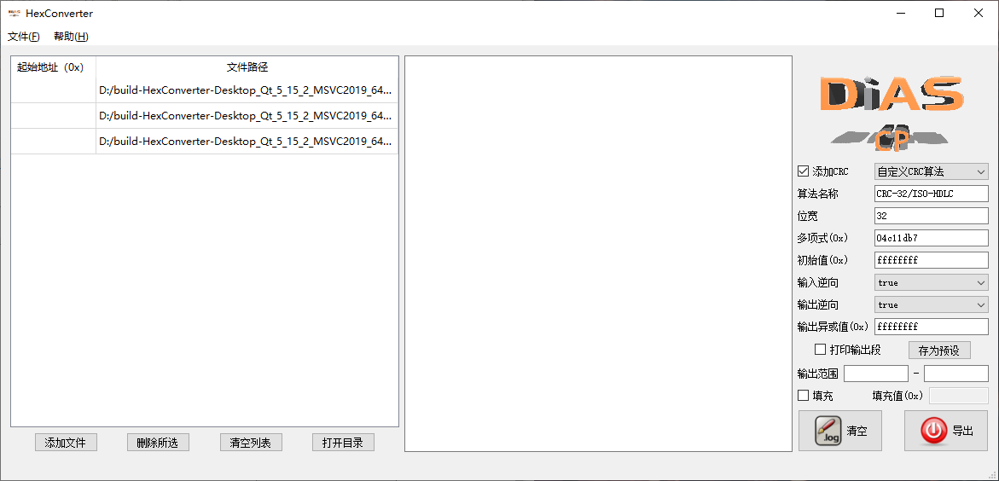

### 保存自定义CRC算法

在输入各算法细节之后，单击“存为预设”按钮即可。注意：算法名称若已存在，则会弹出警告：

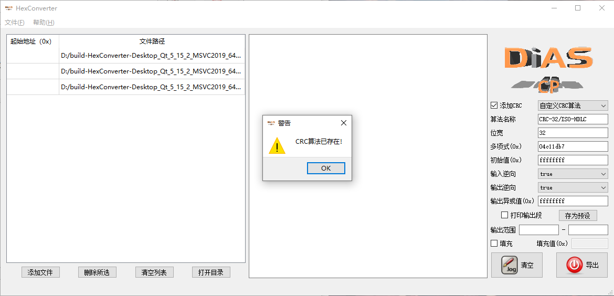

## 限制输出范围

在两个输出范围输入框内填入限制的地址范围，其中靠前的为起始地址，靠后的为结束地址：

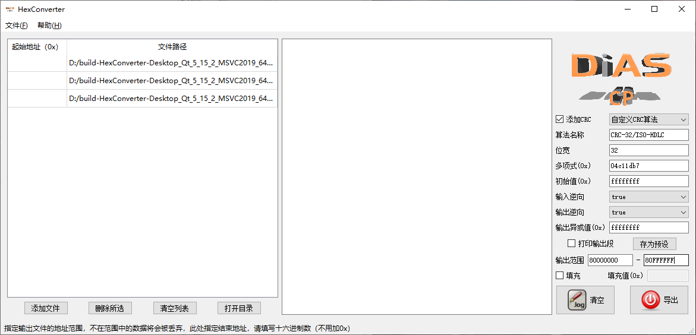

## 段填充

如果要将导入的各段填充为连续的一整段，则可勾选“填充”选框，并在其后的填充值输入框内填入需填充的数值：

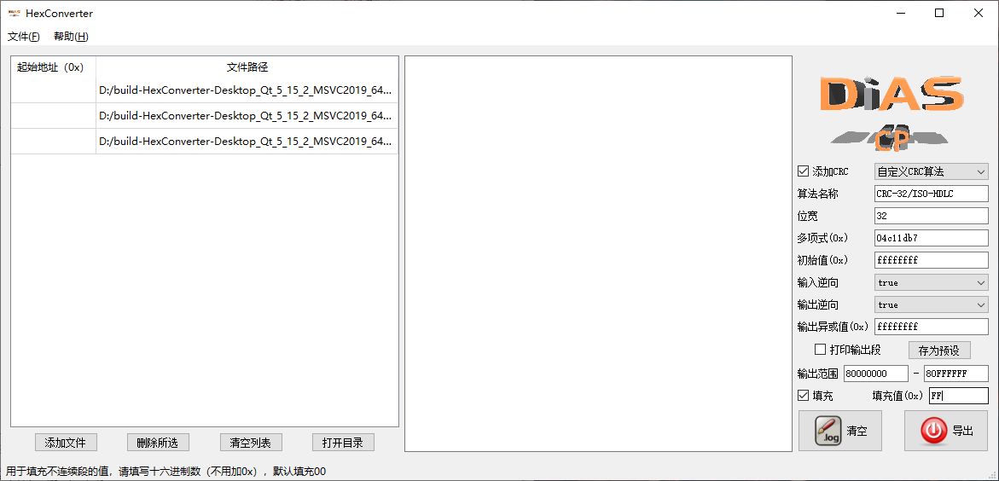

# 注意事项

- 也可以单击“添加文件”按钮来导入文件，或单击菜单栏中文件->导入来完成此操作。
- 若起始地址大于结束地址，则程序理解成不限制输出范围。
- 填充值输入框若为空，则程序理解成填充0x00.
- **当导入段有重复部分时，列表中靠后文件中的重复部分会覆盖靠前的。**

